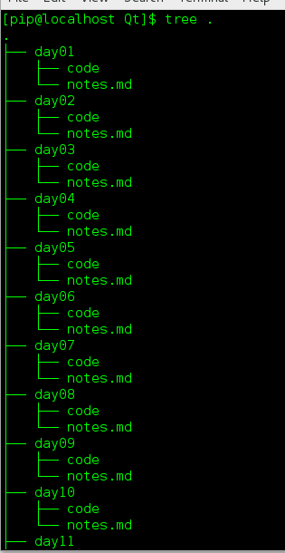

#Python批量创建文件

## 前情提要

> 原因是这样的，我用`mkdir day{01..30}`新建了三十个文件夹，但是我又想在每一个文件夹里面新建一个`notes.md`文件和`code`文件夹，如果我去手动一个一个的新建，那我就是不是程序员了。所以是时候展现以下`Python`的魅力了。

## 没有废话直接上代码

```
import os

dir = os.listdir("./") #获取本目录下的所有文件名

for i in dir:#遍历本文件夹下的所有文件
    if(i != "py.py"):#py.py就是本程序源代码存储的位置
        print("i = ", i)#打印文件名
        os.chdir(i)#进入到文件中
        os.mkdir("code")#创建文件夹
        open("notes.md", "w")#创建文件
        os.chdir("..")#返回到上一级目录
```

## 代码bug修复和优化

* 首先第一点第六行的语句不灵活，如果有其他的非文件夹的文件则需要改动，所以，判断条件改为，`os.path.isdir(i)`比较合适
* 其次第十行，只打开了文件，并没有对文件进行关闭，要做一个负责的人。所以先把第十行的返回值接收一下`fp = open("notes.md")`，再在第十行的后面加上一句`fp.close()`

## 最终代码

```
import os

dir = os.listdir("./")

for i in dir:
	if os.path.isdir(i):
		print("i = ", i)
		os.chdir(i)
		os.mkdir("code")
		fp = open("notes.md", "w")
		fp.close()
		os.chdir("..")
```

## 结果图



> 优化就到这里了，如果有问题欢迎加首页的QQ群讨论

