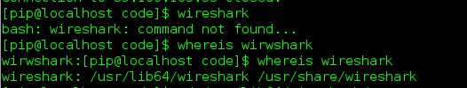
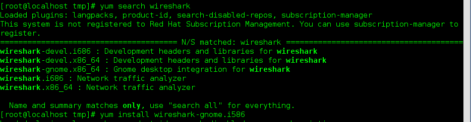
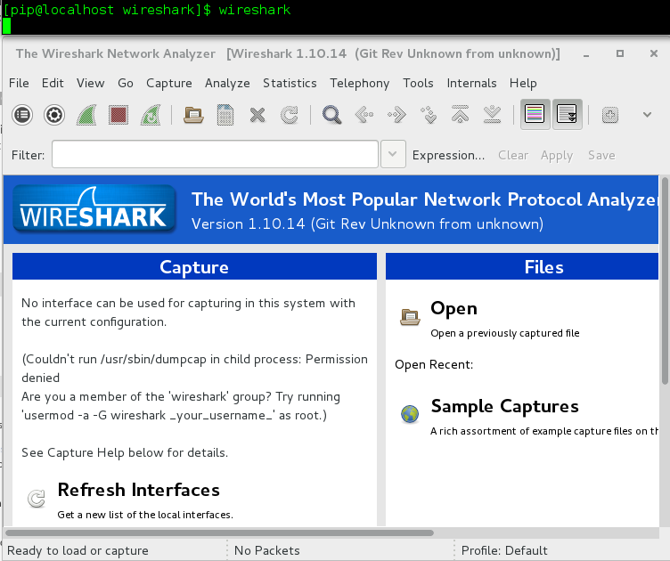

## redhat安装wireshark

参考链接：

https://www.linuxidc.com/Linux/2014-09/106522.htm

https://forums.fedoraforum.org/showthread.php?236740-Wireshark-Install-issues&p=1307301#post1307301

##注意！！！

> **请直接跳到第五步，前三步为本人的坑，希望后人需要重新掉进去，只作为一个警示和总结**

## 1、yum 安装

`yum install -y wireshark`

## 2、运行wireshark

> `WHAT ???`
>
> 居然出错了，emmm，安装姿势不对，找度娘吧，emmmmmmmmmm

## 3、rpm查看是否安装成功了

> emmmmm
>
> 看来安装上了但是为什么不能运行呢，看看大神的解决方法

## 4、卸载错误安装的

> rpm -e wireshark.XXXXXXXX

## 5、正确安装姿势

> 抱歉，前四步都是坑，希望聪慧的你看到了我的注意

* 第一步、从yum下载安装包

  `yumdownloader --resolve --destdir /tmp wireshark`

* 第二步、安装

  `rpm -ivh wireshark.XXXXXX --force`

  > 这里有个小坑，你需要到`/tmp`目录下，因为`wireshark`的安装包已经下载了，`/tmp`目录下，所以`cd /tmp`，然后`ls`一下应该看见了`wireshark`的安装包了吧。然后把`wireshark.XXXXXX`，替换成你要安装的`wireshark`的版本。

* 安装`wireshark`的图形界面

  > 先在`yum`中找到你的`gnome`的包名
  >
  > 然后使用`yum install wiresharkXXXXXXXX`安装

  

* 启动wireshark

  > 只需要在终端输入`wireshark`即可成功启动`wireshark`

